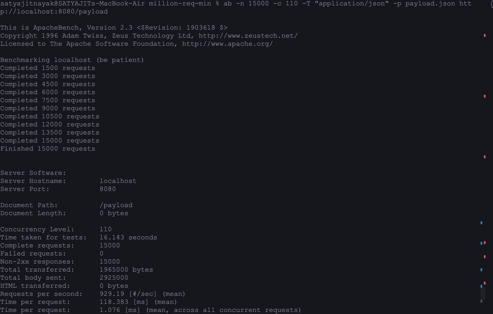

# million-req-min

Handling 1 Million Requests per Minute with Golang

## Stress Testing

Stress testing a web server involves sending a large number of requests to evaluate its performance under heavy load. There are various tools you can use for stress testing, such as Apache Benchmark (`ab`), Vegeta, or wrk. Below is an example using Apache Benchmark to send 10,000 requests per second to your server.

First, make sure your server is running, and then open a terminal to run the stress test:

```bash
ab -n 100000 -c 10000 -T "application/json" -p payload.json http://localhost:8080/payload
```

Explanation of the options:

- `-n`: Total number of requests to perform.
- `-c`: Number of multiple requests to perform at a time.
- `-T`: Content type of the request.
- `-p`: File containing data to POST. You can create a file named `payload.json` with the sample payload data.

Note: Adjust the options according to your specific requirements.

Before running the stress test, make sure to install Apache Benchmark if you haven't already. On Ubuntu, you can install it using:

```bash
sudo apt-get install apache2-utils
```

For mac

```bash
brew install httpd
```

Keep in mind that this stress test is very aggressive and may overwhelm your server. Ensure your server and infrastructure can handle such a high load, and monitor resource usage during the test. Additionally, you might need to adjust the server configuration and other parameters based on the results of your stress test.


